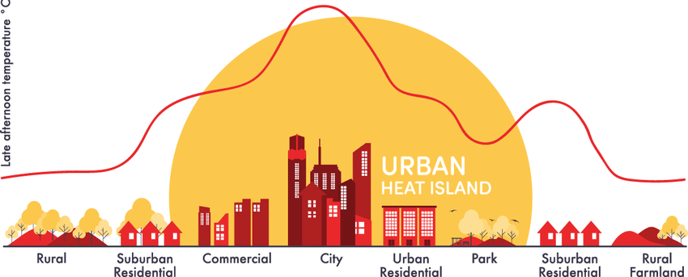

## Metropolitan Climate Profiling: Advanced Analytics of Urban Heat Islands

The main goal of this project is to delve into climatological data for three cities—Dallas, Denton, and Arlington—in and around the Dallas, TX region. The focus is on understanding and categorizing these cities based on the "Urban Heat Island" (UHI) scale.

In climatology, UHI denotes urban areas with higher temperatures compared to neighboring rural areas. This phenomenon arises due to the replacement of natural landscapes with structures that absorb and retain heat, forming what is commonly known as a "micro climate." Essentially, a city's infrastructure creates its own localized weather conditions.

By scrutinizing micro climate data for Dallas, a major urban hub, along with Denton and Arlington as suburban counterparts, the aim is to establish a classification system that reflects different UHI intensities and assign corresponding labels to these cities. Furthermore, a temporal analysis is conducted to compare and contrast various weather patterns associated with different UHI intensities.

This project seeks to enhance our understanding of how urbanization influences local climates, particularly in the context of the Dallas area, and contribute valuable insights into the classification and temporal patterns of Urban Heat Islands.

## Key Features

**1. Seamless Data Integration**: Combined diverse climatological datasets from multiple cities into a unified, analyzable format.

**2. Exploratory Data Analysis (EDA)**: Illuminated seasonal trends, anomalies, and urban-rural climatic differences through vivid visualizations.

**3. Feature Engineering**: Crafted unique features such as seasonal quartiles and daytime-nighttime temperature differences to enrich the dataset and improve model accuracy.

**5. Classification Models**: Developed and fine-tuned multiple machine learning models to classify UHI intensity with high precision.

## Technologies Employed

- **Programming Languages**: Python

- **Data Analysis & Visualization**: Pandas, NumPy, SciPy, Matplotlib, Seaborn

- **Machine Learning**: Scikit-learn, XGBoost

- **Development Environment**: Jupyter Notebook

## Repository Structure

- **`README.md`**: Project documentation and overview.

- **`data/`**: Contains raw and processed climate data files.
    - Raw data files (`Dallas.csv`, `Arlington.csv`, `Denton.csv`)
    - Processed data files (`processed_dallas.csv`, `processed_arlington.csv`, `processed_denton.csv`)
    - Enhanced data files (`enhanced_dallas_with_uhi.csv`, `enhanced_arlington_with_uhi.csv`, `enhanced_denton_with_uhi.csv`)
    - `README.md`: Documentation about the datasets and data processing steps

- **`scripts/`**: Core Python modules for the project.
    - `data_loader.py`: Functions for loading and saving datasets
    - `preprocessing.py`: Data preprocessing and feature engineering
    - `eda.py`: Exploratory data analysis functions
    - `modeling.py`: Machine learning model training and evaluation
    - `feature_engineering.py`: Feature creation and transformation

- **`notebooks/`**: Jupyter notebooks for analysis and visualization.
    - `eda.ipynb`: Exploratory Data Analysis
    - `preprocessing.ipynb`: Data preprocessing steps
    - `feature_engineering.ipynb`: Feature engineering process
    - `modeling.ipynb`: Model development and evaluation

- **`images/`**: Project images for README.md

- **`models/`**: Saved machine learning models.

#### Disclosure:

The dataset is gathered from National Center for Environmental Information (NCEI) (<https://www.ncei.noaa.gov/>).